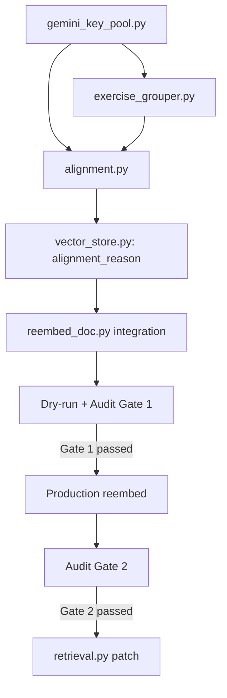

# Phase 2 — LLM Exercise Group Router (Updated)

## Answers to Open Questions

| Q | Decision |
|---|---|
| **Q1 Provider** | Gemini với pool key riêng, cooldown tách biệt khỏi parser pool. Redis TTL-based cooldown state chia sẻ giữa parser và alignment. |
| **Q2 Cache** | Persistent via Postgres (file artifact fallback). Versioned cache key. Redis chỉ dùng tạm. |
| **Q3 Trigger** | Offline trong `reembed_doc.py` trước. Online sau khi audit ổn. |

---

## Design Decisions

> [!IMPORTANT]
> **chapter_id cũng được update từ LLM alignment**, không chỉ section_id. Nếu LLM confident về chapter (high) thì chapter_id BM25 sai nên được sửa:
> ```python
> chunk["chapter_id"]         = alignment.chapter_id
> chunk["chapter_confidence"] = "llm_inferred"
> chunk["section_id"]         = alignment.section_id
> chunk["section_confidence"] = "llm_inferred"
> chunk["alignment_reason"]   = alignment.reason
> ```

> [!IMPORTANT]
> **v1 chỉ accept `confidence="high"` từ LLM**. `medium` → giữ `unknown`, không gán section. Tránh noise từ LLM không chắc.

> [!WARNING]
> **Gate trước khi patch retrieval**: `invalid_ids = 0` VÀ sample precision ≥ 85-90%. Unknown nhiều vẫn OK — không dùng ratio gate.

---

## Proposed Changes

---

### Component 1 — Gemini Key Pool + Cooldown

#### [NEW] [gemini_key_pool.py](file:///e:/Đồ%20án/Project/backend/app/rag/gemini_key_pool.py)

Shared key pool dùng Redis TTL. Cả parser và alignment đọc cùng namespace.

```python
# Redis key: "gemini_cooldown:{sha256(api_key)}"
# Value: reason string (không log raw key)
# TTL by error type:
COOLDOWN_TTL = {
    "recent_use":  30,    # vừa parse xong
    "503":         60,    # server overload
    "429":        300,    # quota exceeded
    "invalid":  86400,    # disabled permanently (1 day TTL)
}

class GeminiKeyPool:
    def get_available_key(self) -> str | None:
        """Trả về key đầu tiên không trong cooldown. None nếu không có."""
    
    def mark_cooldown(self, key: str, reason: str) -> None:
        """Set Redis TTL cho key theo lý do. Log key_hash, không log raw key."""
    
    def mark_used(self, key: str) -> None:
        """Mark recent_use cooldown (30s) sau mỗi lần dùng."""
```

**Parser integration**: Sau mỗi chunk parse thành công/fail, `parser.py` gọi `pool.mark_used(key)` hoặc `pool.mark_cooldown(key, "429")`.

**Alignment**: Gọi `pool.get_available_key()` trước mỗi batch. Nếu `None` → skip alignment, giữ `unknown`.

---

### Component 2 — Versioned Markdown Cache

#### [MODIFY] [reembed_doc.py](file:///e:/Đồ%20án/Project/backend/reembed_doc.py)

Cache key phải versioned để tránh stale khi code thay đổi:

```python
PARSER_VERSION  = "v2.1"   # bump khi thay đổi parser logic
CLEANER_VERSION = "v1.3"   # bump khi thay đổi clean_markdown()

def _markdown_cache_key(doc_id: str, file_hash: str, tree_hash: str) -> str:
    raw = f"{doc_id}:{file_hash}:{PARSER_VERSION}:{CLEANER_VERSION}:{tree_hash}"
    return f"markdown_cache:{sha256(raw)}"
```

**Persistent store**: Lưu vào file `<project>/backend/.cache/markdown/{sha256_key}.txt`. Redis là L1 cache (TTL 7 ngày). File là L2 persistent.

`file_hash` = `sha256(raw_bytes_of_pdf_from_s3)` — tính một lần khi download.

---

### Component 3 — Exercise Group Detector

#### [NEW] [exercise_grouper.py](file:///e:/Đồ%20án/Project/backend/app/rag/exercise_grouper.py)

**Chỉ chạy trên chunks có `section_confidence="unknown"`**. Không đụng chunks đã match canonical heading_tree.

```python
_RE_PART_LABEL    = re.compile(r"PHẦN\s+([IVX]+|[A-Z]|\d+)", re.IGNORECASE)
_RE_MAJOR_HEADING = re.compile(r"^(?:[IVX]+|[A-Z])\.\s+.+$")  # "I. PHẢN XẠ..."
_RE_EXERCISE_NUM  = re.compile(r"Bài\s+(\d+)[.:]?\s", re.IGNORECASE)
_RE_SOLUTION_HDR  = re.compile(  # HƯỚNG DẪN / ĐÁP SỐ
    r"HƯỚNG\s*DẪN|ĐÁP\s*SỐ|LỜI\s*GIẢI", re.IGNORECASE
)
```

**State machine** (scan chunks theo thứ tự):
1. Khi gặp heading khớp `_RE_PART_LABEL` → update `current_part`
2. Khi gặp heading khớp `_RE_MAJOR_HEADING` → update `current_major`
3. Khi gặp `_RE_EXERCISE_NUM` trong content → start new group
4. Khi gặp `_RE_SOLUTION_HDR` → switch to solution-tracking mode

**Group key**: `{doc_id}_{part_norm}_{major_norm}_{exercise_num}`

**Solution linking**: Match `(part_label, exercise_number)` qua problem và solution chunks. **Không merge nếu không chắc** — `solution_text=None`.

```python
@dataclass
class ExerciseGroup:
    group_id: str
    chunk_ids: list[str]            # problem chunks
    solution_chunk_ids: list[str]   # solution chunks (có thể rỗng)
    problem_text: str               # concat, max 1200 chars
    solution_text: str | None
    part_label: str                 # "I", "II"
    major_heading: str              # "PHAN XA ANH SANG"
    exercise_number: int
    chapter_id: str                 # inherited (context only)
```

---

### Component 4 — LLM Alignment Router

#### [NEW] [alignment.py](file:///e:/Đồ%20án/Project/backend/app/rag/alignment.py)

**Pydantic models:**
```python
class ExerciseAlignment(BaseModel):
    group_id: str
    chapter_id: str    # must exist in heading_tree
    section_id: str    # must belong to chapter_id, or ""
    confidence: Literal["high", "medium", "unknown"]
    reason: str

class AlignmentBatch(BaseModel):
    alignments: list[ExerciseAlignment]
```

**Cache key (versioned):**
```python
ALIGNMENT_PROMPT_VERSION = "v1.0"  # bump khi thay đổi prompt

def _alignment_cache_key(group: ExerciseGroup, tree_hash: str, model: str) -> str:
    raw = (
        group.problem_text
        + (group.solution_text or "")
        + tree_hash
        + ALIGNMENT_PROMPT_VERSION
        + model
    )
    return f"alignment_cache:{sha256(raw.encode())}"
```

**Guardrails (sau khi nhận LLM output):**
```python
valid_chapter_ids = {ch["chapter_id"] for ch in tree["chapters"]}
valid_section_ids_by_ch = {
    ch["chapter_id"]: {s["section_id"] for s in ch.get("sections", [])}
    for ch in tree["chapters"]
}

def _validate(a: ExerciseAlignment, tree: dict) -> ExerciseAlignment | None:
    if a.chapter_id not in valid_chapter_ids:
        log_invalid(a)
        return None
    if a.section_id and a.section_id not in valid_section_ids_by_ch.get(a.chapter_id, set()):
        a = a.model_copy(update={"section_id": "", "confidence": "unknown"})
    if a.confidence != "high":  # v1: only accept high
        a = a.model_copy(update={"section_id": "", "confidence": "unknown"})
    return a
```

**Apply to chunks (chỉ khi confidence="high"):**
```python
for chunk in chunks:
    if chunk["chunk_id"] in group.all_chunk_ids:
        chunk["chapter_id"]         = alignment.chapter_id
        chunk["chapter_confidence"] = "llm_inferred"
        chunk["section_id"]         = alignment.section_id   # có thể ""
        chunk["section_confidence"] = "llm_inferred"
        chunk["alignment_reason"]   = alignment.reason
```

**Fail-safe:**
- LLM 429/503 → `pool.mark_cooldown(key, "429")`, skip batch, giữ unknown
- Parse fail → log warning, giữ unknown
- No available key → skip toàn bộ alignment, log "no keys available"

---

### Component 5 — Pinecone Metadata Extension

#### [MODIFY] [vector_store.py](file:///e:/Đồ%20án/Project/backend/app/rag/vector_store.py)

Thêm `alignment_reason` vào metadata:
```python
"alignment_reason": chunk.get("alignment_reason", ""),
```

---

### Component 6 — reembed_doc.py Integration

#### [MODIFY] [reembed_doc.py](file:///e:/Đồ%20án/Project/backend/reembed_doc.py)

```python
# Step A: Markdown cache check (trước parse)
cached_md = check_markdown_cache(doc_id, file_hash, tree_hash, redis)
if cached_md:
    md = cached_md
    print("Using cached markdown (stable parse)")
else:
    md = parse_and_clean(...)
    save_markdown_cache(md, ...)

# Step B: Chunk
chunks = semantic_chunk(md, tree)

# Step C: Exercise group detection
groups = build_exercise_groups(
    chunks=[c for c in chunks if c.get("section_confidence") == "unknown"],
    doc_id=str(doc_id),
)
print(f"Exercise groups detected: {len(groups)}")

# Step D: LLM alignment (async)
pool = GeminiKeyPool(redis)
if pool.get_available_key():
    chunks = await align_exercise_groups(chunks, groups, tree, pool)
else:
    print("No Gemini keys available — skipping alignment, keeping unknown")

# Step E: Embed + upsert (existing)
```

**Dry-run audit report:**
```
Exercise groups detected: 67
  LLM aligned (llm_inferred): 41 groups
  Unknown (no key / low confidence): 26 groups
  Invalid IDs found: 0              ← GATE
  
  Sample mappings (10):
    [group_I_PHAN_XA_1]  → ch1 / ch1_sec1  "bài về phản xạ toàn phần"
    [group_I_KHUC_XA_3]  → ch1 / ch1_sec3  "bài lưỡng chất cầu"
    ...
  
  Section distribution:
    ch1_sec1: 5 groups
    ch1_sec3: 8 groups
    ch2_sec1: 4 groups
    ...
```

---

### Component 7 — Retrieval Update (CUỐI, sau audit)

#### [MODIFY] [retrieval.py](file:///e:/Đồ%20án/Project/backend/app/agents/retrieval.py)

Chỉ implement sau khi audit xác nhận `invalid_ids=0` và precision ≥ 85%.

Pinecone filter syntax đúng:
```python
# Khi user chọn section_id cụ thể
pinecone_filter = {
    "$and": [
        {"document_id": {"$eq": doc_id}},
        {
            "$or": [
                {
                    "$and": [
                        {"section_id": {"$eq": section_id}},
                        {"section_confidence": {"$in": ["high", "llm_inferred"]}},
                    ]
                },
                {
                    "$and": [
                        {"chapter_id": {"$eq": chapter_id}},
                        {"section_confidence": {"$eq": "unknown"}},
                    ]
                },
            ]
        },
    ]
}
```

---

## Verification Gates

### Gate 1 (trước production reembed)
- [ ] Dry-run: `invalid_ids = 0`
- [ ] Manual spot-check 10 sample mappings: precision ≥ 85-90%
- [ ] Section distribution hợp lý theo domain physics

### Gate 2 (trước retrieval patch)
- [ ] Production reembed thành công
- [ ] Pinecone query test: section filter trả về đúng chunks
- [ ] End-to-end: generate exam với section filter, không có out-of-scope questions

---

## Implementation Sequence


