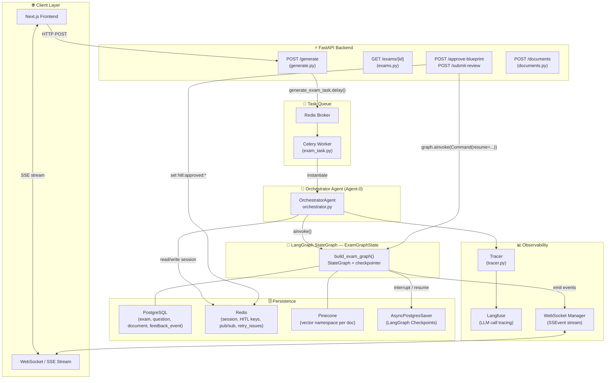
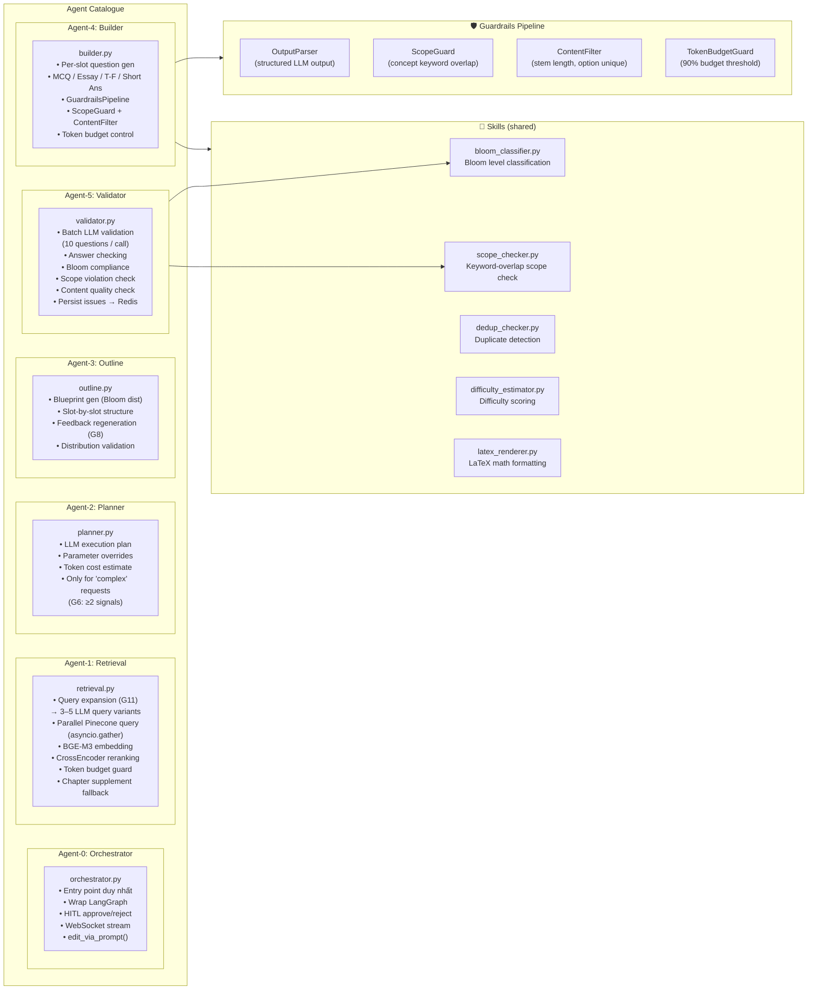
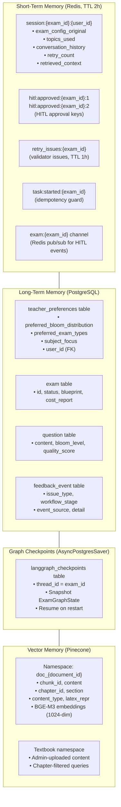
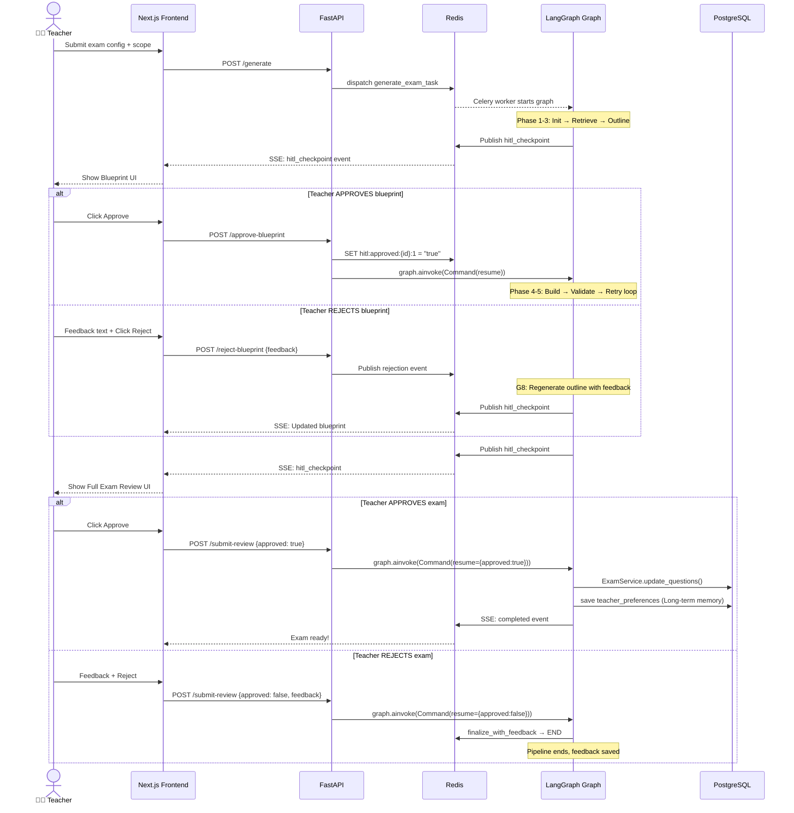
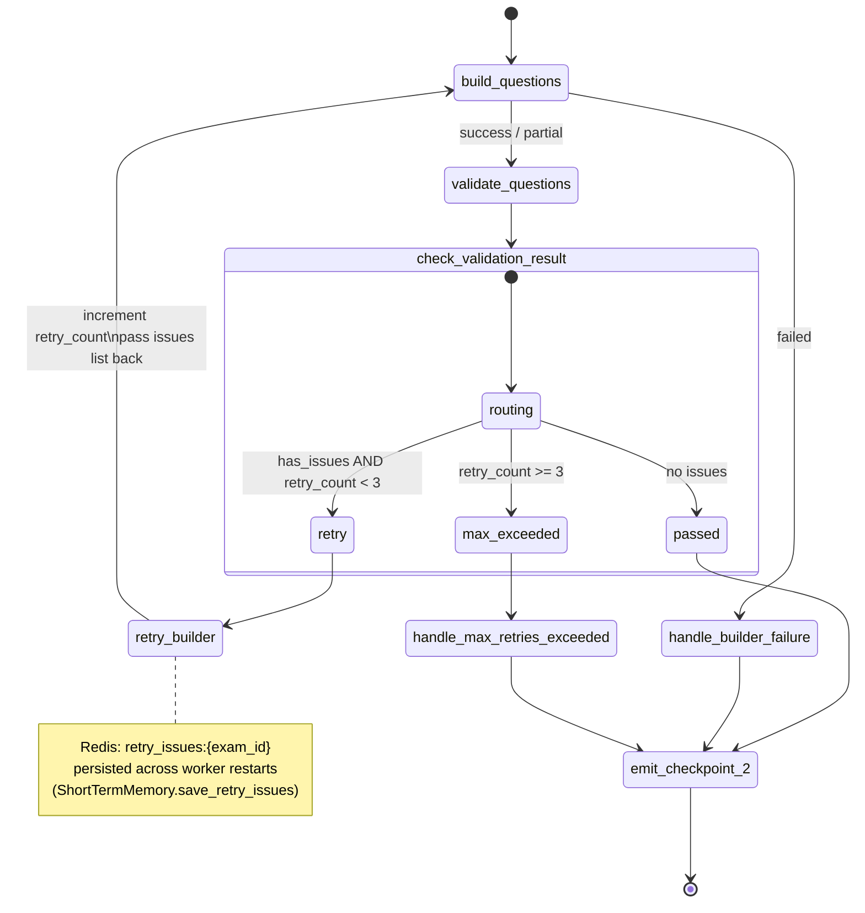
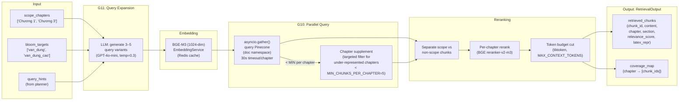
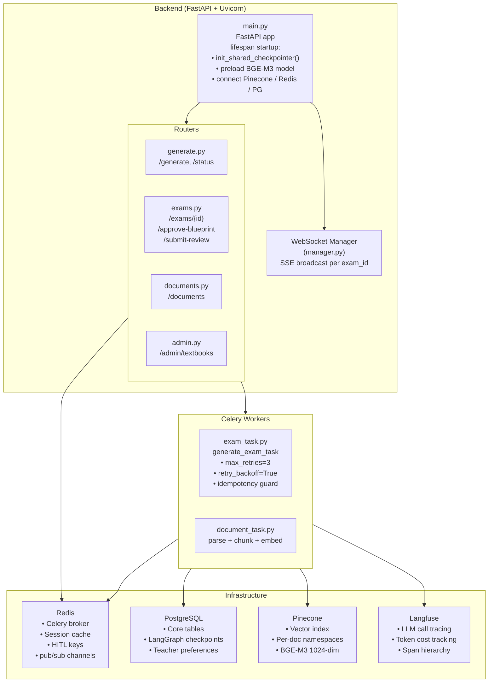

# ExamAI — Multi-Agent System Architecture

> Quét toàn bộ codebase · Vẽ chính xác theo source code thực tế

---

## 🗺️ Tổng quan hệ thống

---

## 🔄 LangGraph Pipeline — Toàn bộ luồng node-by-node

```mermaid
flowchart TD
    START([▶ START]) --> INIT

    subgraph PHASE0["Phase 0 · Setup"]
        INIT["initialize\nInit ExamGraphState\n+ defaults"]
    end

    subgraph PHASE1["Phase 1 · Clarification"]
        CC["clarification_check\nLLM → yêu cầu rõ chưa?"]
        EC["emit_clarification\n→ WebSocket event\n→ END ⏹"]
    end

    subgraph PHASE2["Phase 2 · Planning"]
        LLM_MEM["load_long_term_memory\nPostgres → teacher prefs"]
        DP["decide_plan\ncount complexity signals\n→ 'simple' | 'complex'"]
        FC["fanout_complex\n[passthrough node]\n→ parallel fan-out"]
        PC["plan_complex\nPlannerAgent.create_plan()\nLLM execution plan"]
        RK["retrieve_knowledge\nRetrievalAgent.retrieve()\nQuery Pinecone namespace"]
        HRF["handle_retrieval_failure\n→ create_outline\n(fallback empty context)"]
        MP["merge_plan_retrieval\nMerge plan + retrieved context"]
        DT["dispatch_tasks\nProcess task_queue\n(focused_retrieval etc.)"]
    end

    subgraph PHASE3["Phase 3 · Blueprint (Outline)"]
        CO["create_outline\nOutlineAgent.create_outline()\nBloom blueprint gen"]
        HOF["handle_outline_failure\n→ END ⏹"]
        EP1["emit_checkpoint_1\nEmit hitl_checkpoint #1\n(blueprint preview)"]
    end

    subgraph HITL1["⏸ HITL Checkpoint 1 · Blueprint Review"]
        WBA["wait_for_blueprint_approval\ninterrupt() ⏸\nRedis pub/sub poll\n30-min timeout"]
        WBA_A{"approved?"}
        HTO["handle_timeout → END ⏹"]
    end

    subgraph PHASE4["Phase 4 · Question Generation"]
        BQ["build_questions\nBuilderAgent.build()\nLLM per blueprint slot"]
        HBF["handle_builder_failure\n→ emit_checkpoint_2"]
    end

    subgraph PHASE5["Phase 5 · Validation + Retry Loop (G9)"]
        VQ["validate_questions\nValidatorAgent.validate()\nBatch LLM (BATCH_SIZE=10)\n+ BloomClassifier + ScopeChecker"]
        CVR["check_validation_result\nRoute: passed / retry / max_exceeded"]
        RB["retry_builder\nIncrement retry_count\n(max 3)"]
        HMR["handle_max_retries_exceeded\n→ emit_checkpoint_2"]
    end

    subgraph HITL2["⏸ HITL Checkpoint 2 · Full Exam Review"]
        EP2["emit_checkpoint_2\nEmit hitl_checkpoint #2\n(questions preview)"]
        WFR["wait_for_review\ninterrupt() ⏸\nRedis poll\n30-min timeout"]
        WFR_A{"approved?"}
    end

    subgraph PHASE6["Phase 6 · Finalize"]
        STP["save_teacher_preferences\nLongTermMemory.save()\n→ Postgres"]
        EP3["emit_checkpoint_3\nEmit completion event"]
        FO["finalize_output\nBuild final output\n→ ExamService.update_questions()\n→ END ✅"]
        FWF["finalize_with_feedback\nSave feedback\n→ END ⏹"]
    end

    %% ── Phase 0 → 1 ───────────────────────────────────────
    INIT --> CC
    CC -->|"clarification_needed"| EC
    CC -->|"requirements_clear"| LLM_MEM

    %% ── Phase 2 ─────────────────────────────────────────
    LLM_MEM --> DP
    DP -->|"complex"| FC
    DP -->|"simple"| RK
    FC --> PC
    FC --> RK
    PC --> MP
    RK -->|"success / partial"| MP
    RK -->|"failed"| HRF
    HRF --> CO
    MP --> DT
    DT --> CO

    %% ── Phase 3 ─────────────────────────────────────────
    CO -->|"success / partial"| EP1
    CO -->|"failed"| HOF
    EP1 --> WBA

    %% ── HITL 1 ──────────────────────────────────────────
    WBA --> WBA_A
    WBA_A -->|"approved"| BQ
    WBA_A -->|"rejected → feedback"| CO
    WBA_A -->|"waiting (END, resume later)"| RESUME1(["⏸ Graph saved\nResume via HTTP"])
    WBA_A -->|"timeout"| HTO

    %% ── Phase 4 ─────────────────────────────────────────
    BQ -->|"success / partial"| VQ
    BQ -->|"failed"| HBF

    %% ── Phase 5 (retry loop G9) ─────────────────────────
    VQ --> CVR
    CVR -->|"passed"| EP2
    CVR -->|"retry (count < 3)"| RB
    CVR -->|"max_exceeded"| HMR
    RB --> BQ
    HMR --> EP2
    HBF --> EP2

    %% ── HITL 2 ──────────────────────────────────────────
    EP2 --> WFR
    WFR --> WFR_A
    WFR_A -->|"approved"| STP
    WFR_A -->|"rejected"| FWF
    WFR_A -->|"timeout"| HTO

    %% ── Phase 6 ─────────────────────────────────────────
    STP --> EP3
    EP3 --> FO

    %% ── Styling ─────────────────────────────────────────
    classDef hitl fill:#f59e0b,stroke:#d97706,color:#000
    classDef error fill:#ef4444,stroke:#b91c1c,color:#fff
    classDef success fill:#10b981,stroke:#059669,color:#fff
    classDef agent fill:#3b82f6,stroke:#2563eb,color:#fff
    classDef decision fill:#8b5cf6,stroke:#7c3aed,color:#fff

    class WBA,WFR,EP1,EP2 hitl
    class HRF,HOF,HBF,HMR,HTO,FWF error
    class FO success
    class CC,PC,RK,CO,BQ,VQ agent
    class WBA_A,WFR_A,CVR decision
```

---

## 🤖 Agent Breakdown — Chi tiết từng Agent

---

## 🧠 Memory Architecture

---

## 📡 HITL Interaction Flow — Luồng Human-in-the-Loop

---

## 🔁 Retry Loop Detail — G9 Validation

---

## 🔍 RAG Pipeline — Retrieval Detail

---

## 🏗️ Infrastructure Overview

---

## 📋 Node Registry — Tất cả 29 nodes trong graph

| # | Node | Phase | Mô tả |
|---|------|-------|--------|
| 1 | `initialize` | Setup | Init ExamGraphState, set defaults |
| 2 | `clarification_check` | Clarification | LLM check: yêu cầu rõ chưa? |
| 3 | `emit_clarification` | Clarification | Emit WS event, → END |
| 4 | `load_long_term_memory` | Planning | Load teacher prefs từ Postgres |
| 5 | `decide_plan` | Planning | Count signals → simple / complex |
| 6 | `fanout_complex` | Planning | Passthrough → parallel fan-out |
| 7 | `plan_complex` | Planning | PlannerAgent.create_plan() |
| 8 | `retrieve_knowledge` | Planning | RetrievalAgent.retrieve() |
| 9 | `handle_retrieval_failure` | Error | Fallback → create_outline (empty ctx) |
| 10 | `merge_plan_retrieval` | Planning | Merge plan + retrieved context |
| 11 | `dispatch_tasks` | Planning | Process dynamic task_queue |
| 12 | `create_outline` | Blueprint | OutlineAgent.create_outline() |
| 13 | `handle_outline_failure` | Error | → END |
| 14 | `emit_checkpoint_1` | HITL-1 | Emit blueprint preview event |
| 15 | `wait_for_blueprint_approval` | HITL-1 | `interrupt()` ⏸ Redis pub/sub poll |
| 16 | `build_questions` | Generation | BuilderAgent.build() |
| 17 | `handle_builder_failure` | Error | → emit_checkpoint_2 |
| 18 | `validate_questions` | Validation | ValidatorAgent.validate() batched |
| 19 | `check_validation_result` | Validation | Route: passed / retry / max_exceeded |
| 20 | `retry_builder` | Retry (G9) | Increment counter, pass issues |
| 21 | `handle_max_retries_exceeded` | Error | → emit_checkpoint_2 |
| 22 | `emit_checkpoint_2` | HITL-2 | Emit questions preview event |
| 23 | `wait_for_review` | HITL-2 | `interrupt()` ⏸ Redis poll |
| 24 | `save_teacher_preferences` | Finalize | LongTermMemory.save() → Postgres |
| 25 | `emit_checkpoint_3` | Finalize | Emit completion event |
| 26 | `finalize_output` | Finalize | update_questions() → DB, → END ✅ |
| 27 | `finalize_with_feedback` | Finalize | Save feedback, → END |
| 28 | `handle_timeout` | Error | → END |
| 29 | `dispatch_tasks` | Planning | Dynamic task queue execution |

---

> **Nguồn**: Quét trực tiếp từ `graph/builder.py`, `graph/nodes/__init__.py`, `orchestrator.py`, `retrieval.py`, `outline.py`, `validator.py`, `planner.py`, `memory/short_term.py`, `memory/long_term.py`, `guardrails.py`, `tasks/exam_task.py`, `websocket/manager.py`
